# [📈 Live Status](https://uptime.igluonline.com): <!--live status--> **🟧 Partial outage**

This repository contains the open-source uptime monitor and status page for [Upptime](https://upptime.js.org), powered by [Upptime](https://github.com/upptime/upptime).

With [Upptime](https://upptime.js.org), you can get your own unlimited and free uptime monitor and status page, powered entirely by a GitHub repository. We use [Issues](https://github.com/upptime/upptime/issues) as incident reports, [Actions](https://github.com/andrelug/uptime/actions) as uptime monitors, and [Pages](https://uptime.igluonline.com) for the status page.

<!--start: status pages-->
<!-- This summary is generated by Upptime (https://github.com/upptime/upptime) -->
<!-- Do not edit this manually, your changes will be overwritten -->
<!-- prettier-ignore -->
| URL | Status | History | Response Time | Uptime |
| --- | ------ | ------- | ------------- | ------ |
|  [Iglu Online](https://igluonline.com) | 🟩 Up | [iglu-online.yml](https://github.com/andrelug/uptime/commits/HEAD/history/iglu-online.yml) | 

 212ms
     
 | 

<a href="https://uptime.igluonline.com/history/iglu-online">100.00%</a>
    

|  [André Lug](https://andrelug.com) | 🟩 Up | [andre-lug.yml](https://github.com/andrelug/uptime/commits/HEAD/history/andre-lug.yml) | 

 205ms
     
 | 

<a href="https://uptime.igluonline.com/history/andre-lug">100.00%</a>
    

|  [Above Marketing](https://abovemarketing.com.br) | 🟩 Up | [above-marketing.yml](https://github.com/andrelug/uptime/commits/HEAD/history/above-marketing.yml) | 

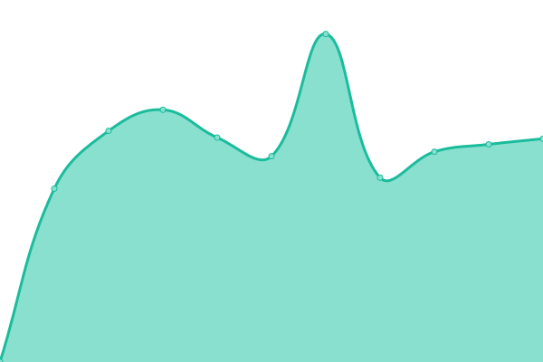 349ms
     
 | 

<a href="https://uptime.igluonline.com/history/above-marketing">100.00%</a>
    

|  [Aeroengenharia](https://aeroengenharia.com) | 🟩 Up | [aeroengenharia.yml](https://github.com/andrelug/uptime/commits/HEAD/history/aeroengenharia.yml) | 

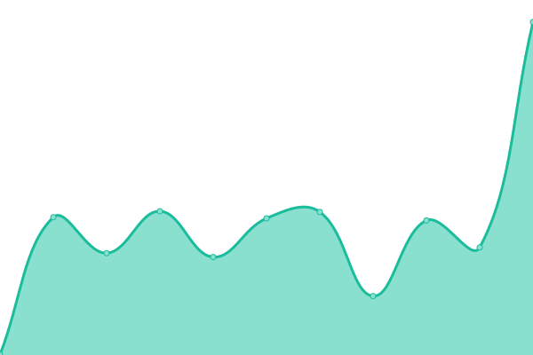 207ms
     
 | 

<a href="https://uptime.igluonline.com/history/aeroengenharia">100.00%</a>
    

|  [AG Santos Engenharia](http://agsantosengenharia.com.br) | 🟩 Up | [ag-santos-engenharia.yml](https://github.com/andrelug/uptime/commits/HEAD/history/ag-santos-engenharia.yml) | 

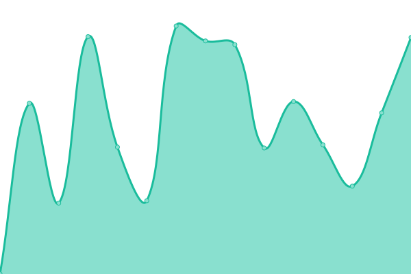 819ms
     
 | 

<a href="https://uptime.igluonline.com/history/ag-santos-engenharia">99.45%</a>
    

|  [Alliance BH](https://alliancebh.com.br) | 🟩 Up | [alliance-bh.yml](https://github.com/andrelug/uptime/commits/HEAD/history/alliance-bh.yml) | 

 269ms
     
 | 

<a href="https://uptime.igluonline.com/history/alliance-bh">100.00%</a>
    

|  [Blog Comparar](https://blog.compararsegurodeviagem.com.br) | 🟩 Up | [blog-comparar.yml](https://github.com/andrelug/uptime/commits/HEAD/history/blog-comparar.yml) | 

 3140ms
     
 | 

<a href="https://uptime.igluonline.com/history/blog-comparar">100.00%</a>
    

|  [Cargo Sapiens](https://cargosapiens.com) | 🟩 Up | [cargo-sapiens.yml](https://github.com/andrelug/uptime/commits/HEAD/history/cargo-sapiens.yml) | 

 168ms
     
 | 

<a href="https://uptime.igluonline.com/history/cargo-sapiens">100.00%</a>
    

|  [Claudia Lima](https://claudialima.com) | 🟩 Up | [claudia-lima.yml](https://github.com/andrelug/uptime/commits/HEAD/history/claudia-lima.yml) | 

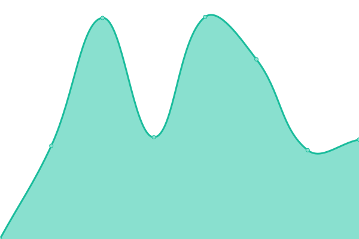 1582ms
     
 | 

<a href="https://uptime.igluonline.com/history/claudia-lima">100.00%</a>
    

|  [Clerimar](https://clerimar.com.br) | 🟩 Up | [clerimar.yml](https://github.com/andrelug/uptime/commits/HEAD/history/clerimar.yml) | 

 1464ms
     
 | 

<a href="https://uptime.igluonline.com/history/clerimar">98.99%</a>
    

|  [Corpo Escola de Dança](https://corpoescoladedanca.com) | 🟩 Up | [corpo-escola-de-danca.yml](https://github.com/andrelug/uptime/commits/HEAD/history/corpo-escola-de-danca.yml) | 

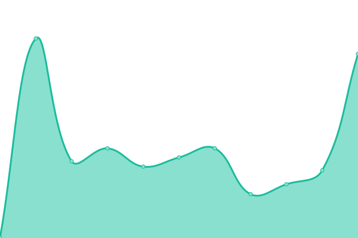 302ms
     
 | 

<a href="https://uptime.igluonline.com/history/corpo-escola-de-danca">100.00%</a>
    

|  [Dany Carvalho](https://danycarvalho.com) | 🟩 Up | [dany-carvalho.yml](https://github.com/andrelug/uptime/commits/HEAD/history/dany-carvalho.yml) | 

 242ms
     
 | 

<a href="https://uptime.igluonline.com/history/dany-carvalho">100.00%</a>
    

|  [Edap](https://edap.com.br) | 🟩 Up | [edap.yml](https://github.com/andrelug/uptime/commits/HEAD/history/edap.yml) | 

 272ms
     
 | 

<a href="https://uptime.igluonline.com/history/edap">100.00%</a>
    

|  [EMMA](https://emmaarquitetura.com.br) | 🟩 Up | [emma.yml](https://github.com/andrelug/uptime/commits/HEAD/history/emma.yml) | 

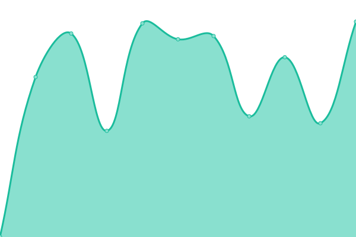 1070ms
     
 | 

<a href="https://uptime.igluonline.com/history/emma">99.77%</a>
    

|  [Instituto Corpo](https://institutocorpo.org) | 🟩 Up | [instituto-corpo.yml](https://github.com/andrelug/uptime/commits/HEAD/history/instituto-corpo.yml) | 

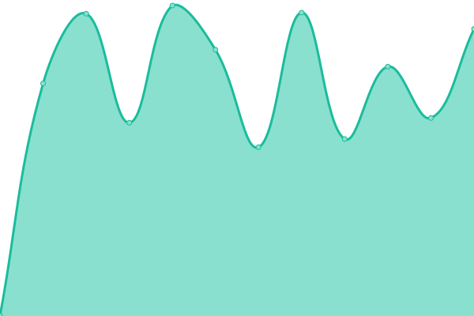 692ms
     
 | 

<a href="https://uptime.igluonline.com/history/instituto-corpo">98.91%</a>
    

|  [Juliana Saldanha](https://julianasaldanha.com.br) | 🟩 Up | [juliana-saldanha.yml](https://github.com/andrelug/uptime/commits/HEAD/history/juliana-saldanha.yml) | 

 240ms
     
 | 

<a href="https://uptime.igluonline.com/history/juliana-saldanha">100.00%</a>
    

|  [We Launch](https://welaunch.com.br) | 🟩 Up | [we-launch.yml](https://github.com/andrelug/uptime/commits/HEAD/history/we-launch.yml) | 

 2434ms
     
 | 

<a href="https://uptime.igluonline.com/history/we-launch">100.00%</a>
    

|  [Life Line](https://lifelinestore.com.br) | 🟩 Up | [life-line.yml](https://github.com/andrelug/uptime/commits/HEAD/history/life-line.yml) | 

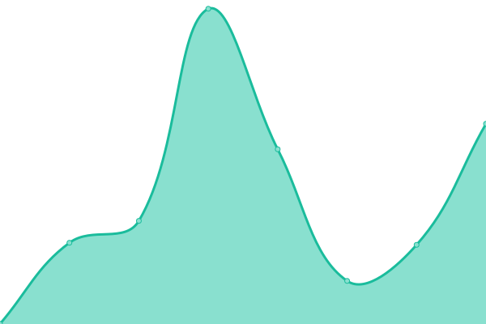 263ms
     
 | 

<a href="https://uptime.igluonline.com/history/life-line">100.00%</a>
    

|  [Marukame](http://marukame.com.br) | 🟩 Up | [marukame.yml](https://github.com/andrelug/uptime/commits/HEAD/history/marukame.yml) | 

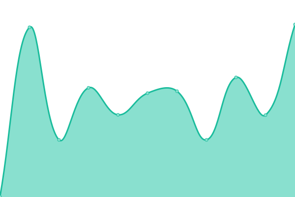 204ms
     
 | 

<a href="https://uptime.igluonline.com/history/marukame">100.00%</a>
    

|  [Matheus Gepeto](https://matheusgepeto.com) | 🟩 Up | [matheus-gepeto.yml](https://github.com/andrelug/uptime/commits/HEAD/history/matheus-gepeto.yml) | 

 1335ms
     
 | 

<a href="https://uptime.igluonline.com/history/matheus-gepeto">100.00%</a>
    

|  [Mautic Iglu](https://mkt.igluonline.com) | 🟩 Up | [mautic-iglu.yml](https://github.com/andrelug/uptime/commits/HEAD/history/mautic-iglu.yml) | 

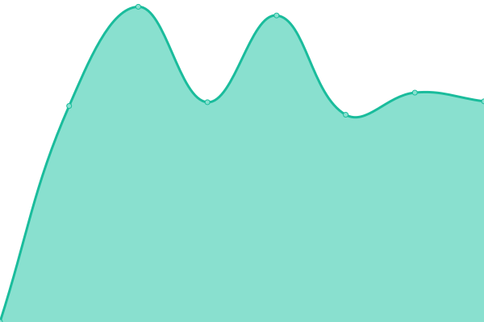 2051ms
     
 | 

<a href="https://uptime.igluonline.com/history/mautic-iglu">100.00%</a>
    

|  [Mautic Ju Saldanha](https://mkt.julianasaldanha.com.br) | 🟩 Up | [mautic-ju-saldanha.yml](https://github.com/andrelug/uptime/commits/HEAD/history/mautic-ju-saldanha.yml) | 

 2390ms
     
 | 

<a href="https://uptime.igluonline.com/history/mautic-ju-saldanha">100.00%</a>
    

|  [Blog Nephew](https://blog.nephew.com.br) | 🟥 Down | [blog-nephew.yml](https://github.com/andrelug/uptime/commits/HEAD/history/blog-nephew.yml) | 

 0ms
     
 | 

<a href="https://uptime.igluonline.com/history/blog-nephew">0.00%</a>
    

|  [Paula Tavares](https://paulatavares.com) | 🟥 Down | [paula-tavares.yml](https://github.com/andrelug/uptime/commits/HEAD/history/paula-tavares.yml) | 

 0ms
     
 | 

<a href="https://uptime.igluonline.com/history/paula-tavares">0.00%</a>
    

|  [Pedro Londe](https://pedrolonde.com) | 🟩 Up | [pedro-londe.yml](https://github.com/andrelug/uptime/commits/HEAD/history/pedro-londe.yml) | 

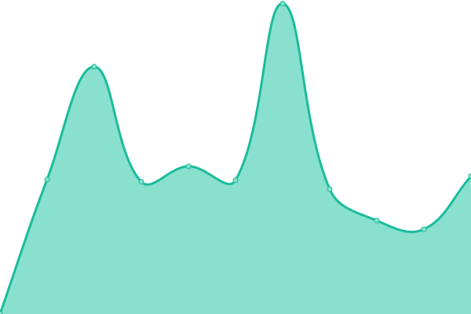 1729ms
     
 | 

<a href="https://uptime.igluonline.com/history/pedro-londe">100.00%</a>
    

|  [Promo LF](https://promo.lfcomprinhas.com.br) | 🟩 Up | [promo-lf.yml](https://github.com/andrelug/uptime/commits/HEAD/history/promo-lf.yml) | 

 322ms
     
 | 

<a href="https://uptime.igluonline.com/history/promo-lf">100.00%</a>
    

|  [Psiforense](https://psiforense.com.br) | 🟩 Up | [psiforense.yml](https://github.com/andrelug/uptime/commits/HEAD/history/psiforense.yml) | 

 908ms
     
 | 

<a href="https://uptime.igluonline.com/history/psiforense">100.00%</a>
    

|  [Ignorância Diversificada](https://ignoranciadiversificada.com) | 🟥 Down | [ignorancia-diversificada.yml](https://github.com/andrelug/uptime/commits/HEAD/history/ignorancia-diversificada.yml) | 

 0ms
     
 | 

<a href="https://uptime.igluonline.com/history/ignorancia-diversificada">0.00%</a>
    

|  [Sônia Reimberg](https://soniareimberg.com.br) | 🟩 Up | [sonia-reimberg.yml](https://github.com/andrelug/uptime/commits/HEAD/history/sonia-reimberg.yml) | 

 281ms
     
 | 

<a href="https://uptime.igluonline.com/history/sonia-reimberg">100.00%</a>
    

|  [Travel Card Assist](https://travelcardassist.com.br) | 🟩 Up | [travel-card-assist.yml](https://github.com/andrelug/uptime/commits/HEAD/history/travel-card-assist.yml) | 

 278ms
     
 | 

<a href="https://uptime.igluonline.com/history/travel-card-assist">100.00%</a>
    

|  [Upperclick](https://upperclick.com.br) | 🟩 Up | [upperclick.yml](https://github.com/andrelug/uptime/commits/HEAD/history/upperclick.yml) | 

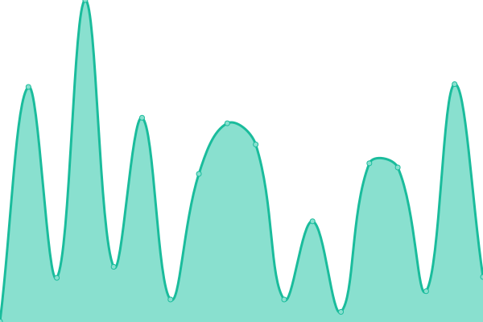 141ms
     
 | 

<a href="https://uptime.igluonline.com/history/upperclick">100.00%</a>
    

|  [Upperclick](https://upperclick.com.br) | 🟩 Up | [upperclick.yml](https://github.com/andrelug/uptime/commits/HEAD/history/upperclick.yml) | 

 141ms
     
 | 

<a href="https://uptime.igluonline.com/history/upperclick">100.00%</a>
    

|  [Youngerderm](https://youngerderm.com.br) | 🟩 Up | [youngerderm.yml](https://github.com/andrelug/uptime/commits/HEAD/history/youngerderm.yml) | 

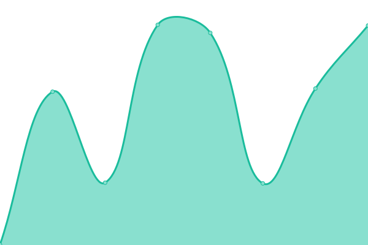 3256ms
     
 | 

<a href="https://uptime.igluonline.com/history/youngerderm">100.00%</a>
    

|  [Destec](https://destec.com.br) | 🟩 Up | [destec.yml](https://github.com/andrelug/uptime/commits/HEAD/history/destec.yml) | 

 1706ms
     
 | 

<a href="https://uptime.igluonline.com/history/destec">100.00%</a>
    

|  [Casa Fluminense](https://casafluminense.org.br) | 🟩 Up | [casa-fluminense.yml](https://github.com/andrelug/uptime/commits/HEAD/history/casa-fluminense.yml) | 

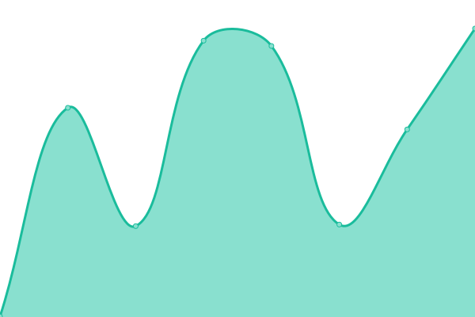 220ms
     
 | 

<a href="https://uptime.igluonline.com/history/casa-fluminense">100.00%</a>
    

|  [Agenda Rio](https://agendario.org) | 🟩 Up | [agenda-rio.yml](https://github.com/andrelug/uptime/commits/HEAD/history/agenda-rio.yml) | 

 125ms
     
 | 

<a href="https://uptime.igluonline.com/history/agenda-rio">100.00%</a>
    

|  [Almanaque Casaflu](https://almanaque.casafluminense.org.br) | 🟩 Up | [almanaque-casaflu.yml](https://github.com/andrelug/uptime/commits/HEAD/history/almanaque-casaflu.yml) | 

 187ms
     
 | 

<a href="https://uptime.igluonline.com/history/almanaque-casaflu">100.00%</a>
    

|  [Não Foi em Vão Casaflu](https://naofoiemvao.casafluminense.org.br) | 🟩 Up | [nao-foi-em-vao-casaflu.yml](https://github.com/andrelug/uptime/commits/HEAD/history/nao-foi-em-vao-casaflu.yml) | 

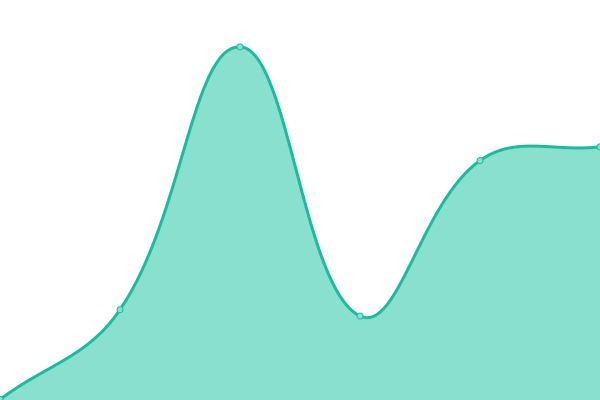 187ms
     
 | 

<a href="https://uptime.igluonline.com/history/nao-foi-em-vao-casaflu">100.00%</a>
    

|  [Parlamento Casaflu](https://parlamento.casafluminense.org.br) | 🟩 Up | [parlamento-casaflu.yml](https://github.com/andrelug/uptime/commits/HEAD/history/parlamento-casaflu.yml) | 

 172ms
     
 | 

<a href="https://uptime.igluonline.com/history/parlamento-casaflu">100.00%</a>
    

|  [Fórum Rio](https://forumrio.org) | 🟩 Up | [forum-rio.yml](https://github.com/andrelug/uptime/commits/HEAD/history/forum-rio.yml) | 

 104ms
     
 | 

<a href="https://uptime.igluonline.com/history/forum-rio">100.00%</a>
    

|  [Park Education](https://parkeducation.com.br) | 🟩 Up | [park-education.yml](https://github.com/andrelug/uptime/commits/HEAD/history/park-education.yml) | 

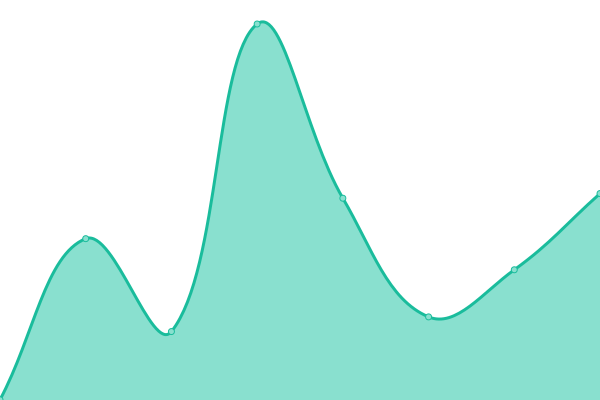 1010ms
     
 | 

<a href="https://uptime.igluonline.com/history/park-education">100.00%</a>
    

|  [Agapesos](https://agapesos.com.br) | 🟩 Up | [agapesos.yml](https://github.com/andrelug/uptime/commits/HEAD/history/agapesos.yml) | 

 2176ms
     
 | 

<a href="https://uptime.igluonline.com/history/agapesos">100.00%</a>
    

|  [Dra Carolina Lamac](https://dracarolinalamac.com.br) | 🟩 Up | [dra-carolina-lamac.yml](https://github.com/andrelug/uptime/commits/HEAD/history/dra-carolina-lamac.yml) | 

 2682ms
     
 | 

<a href="https://uptime.igluonline.com/history/dra-carolina-lamac">100.00%</a>
    

|  [Home Store Delas](https://homestoredelas.com) | 🟩 Up | [home-store-delas.yml](https://github.com/andrelug/uptime/commits/HEAD/history/home-store-delas.yml) | 

 1286ms
     
 | 

<a href="https://uptime.igluonline.com/history/home-store-delas">100.00%</a>
    

|  [Paraiso Caipira](https://paraisocaipira.com.br) | 🟩 Up | [paraiso-caipira.yml](https://github.com/andrelug/uptime/commits/HEAD/history/paraiso-caipira.yml) | 

 3813ms
     
 | 

<a href="https://uptime.igluonline.com/history/paraiso-caipira">100.00%</a>
    

|  [Rede 60 Mais](https://rede60mais.org.br) | 🟩 Up | [rede-60-mais.yml](https://github.com/andrelug/uptime/commits/HEAD/history/rede-60-mais.yml) | 

 240ms
     
 | 

<a href="https://uptime.igluonline.com/history/rede-60-mais">99.88%</a>
    

|  [Rede Longevidade](https://redelongevidade.org.br) | 🟩 Up | [rede-longevidade.yml](https://github.com/andrelug/uptime/commits/HEAD/history/rede-longevidade.yml) | 

 241ms
     
 | 

<a href="https://uptime.igluonline.com/history/rede-longevidade">100.00%</a>
    

|  [Rede Longevidade Conexão 60](https://redelongevidade.org.br/conexao60) | 🟩 Up | [rede-longevidade-conexao-60.yml](https://github.com/andrelug/uptime/commits/HEAD/history/rede-longevidade-conexao-60.yml) | 

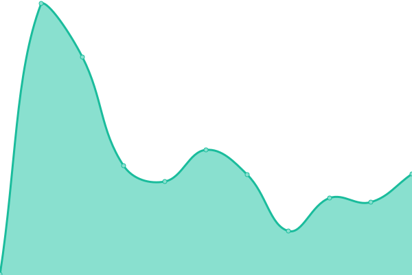 71ms
     
 | 

<a href="https://uptime.igluonline.com/history/rede-longevidade-conexao-60">100.00%</a>
    

|  [Nosso Amigo](https://nossoamigo.org) | 🟩 Up | [nosso-amigo.yml](https://github.com/andrelug/uptime/commits/HEAD/history/nosso-amigo.yml) | 

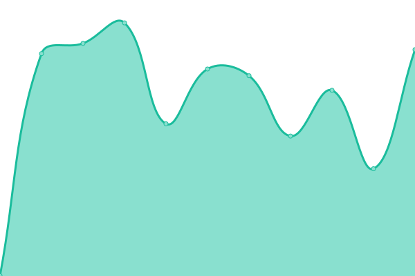 1230ms
     
 | 

<a href="https://uptime.igluonline.com/history/nosso-amigo">100.00%</a>
    

|  [Hélio Venâncio](https://heliovenancio.com.br) | 🟩 Up | [helio-venancio.yml](https://github.com/andrelug/uptime/commits/HEAD/history/helio-venancio.yml) | 

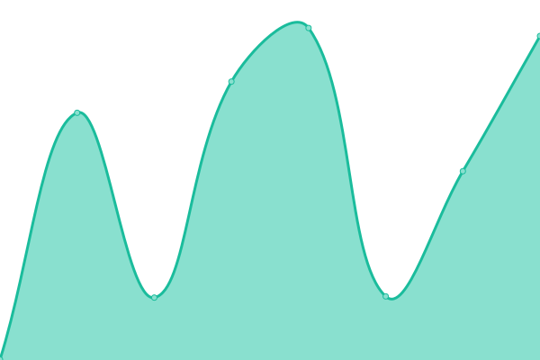 284ms
     
 | 

<a href="https://uptime.igluonline.com/history/helio-venancio">92.70%</a>
    

|  [Agência Midas](https://agenciamidas.com.br) | 🟩 Up | [agencia-midas.yml](https://github.com/andrelug/uptime/commits/HEAD/history/agencia-midas.yml) | 

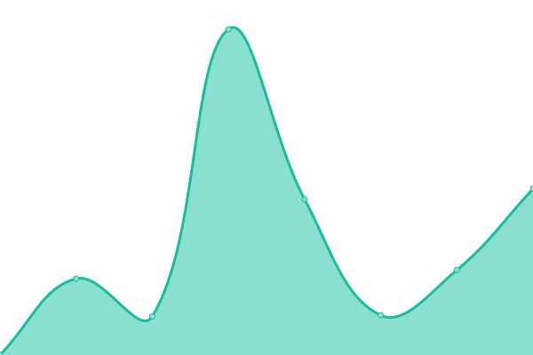 239ms
     
 | 

<a href="https://uptime.igluonline.com/history/agencia-midas">99.75%</a>
    

|  [Aplica ai](https://aplica.ai) | 🟩 Up | [aplica-ai.yml](https://github.com/andrelug/uptime/commits/HEAD/history/aplica-ai.yml) | 

 188ms
     
 | 

<a href="https://uptime.igluonline.com/history/aplica-ai">100.00%</a>
    

|  [Orthoflix](https://orthoflix.com.br) | 🟩 Up | [orthoflix.yml](https://github.com/andrelug/uptime/commits/HEAD/history/orthoflix.yml) | 

 386ms
     
 | 

<a href="https://uptime.igluonline.com/history/orthoflix">100.00%</a>
    

|  [Desaposentados Digitais](https://desaposentadosdigitais.com.br) | 🟩 Up | [desaposentados-digitais.yml](https://github.com/andrelug/uptime/commits/HEAD/history/desaposentados-digitais.yml) | 

 273ms
     
 | 

<a href="https://uptime.igluonline.com/history/desaposentados-digitais">93.35%</a>
    

|  [Agência Movein](https://agenciamovein.com.br) | 🟩 Up | [agencia-movein.yml](https://github.com/andrelug/uptime/commits/HEAD/history/agencia-movein.yml) | 

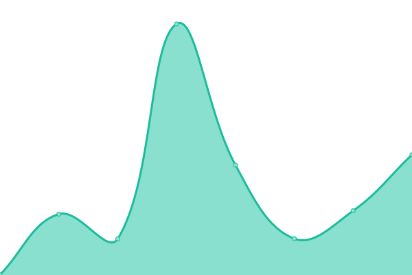 213ms
     
 | 

<a href="https://uptime.igluonline.com/history/agencia-movein">93.10%</a>
    

<!--end: status pages-->

[**Visit our status website →**](https://uptime.igluonline.com)

## 📄 License

- Powered by: [Upptime](https://github.com/upptime/upptime)
- Code: [MIT](./LICENSE) © [Upptime](https://upptime.js.org)
- Data in the `./history` directory: [Open Database License](https://opendatacommons.org/licenses/odbl/1-0/)
