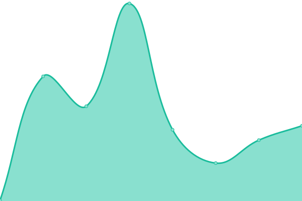
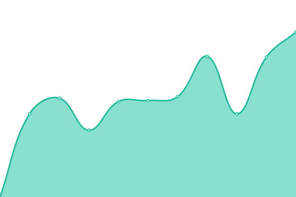

# [📈 Live Status](https://uptime.igluonline.com): <!--live status--> **🟩 All systems operational**

This repository contains the open-source uptime monitor and status page for [Upptime](https://upptime.js.org), powered by [Upptime](https://github.com/upptime/upptime).

With [Upptime](https://upptime.js.org), you can get your own unlimited and free uptime monitor and status page, powered entirely by a GitHub repository. We use [Issues](https://github.com/upptime/upptime/issues) as incident reports, [Actions](https://github.com/upptime/upptime/actions) as uptime monitors, and [Pages](https://uptime.igluonline.com) for the status page.

<!--start: status pages-->
<!-- This summary is generated by Upptime (https://github.com/upptime/upptime) -->
<!-- Do not edit this manually, your changes will be overwritten -->
<!-- prettier-ignore -->
| URL | Status | History | Response Time | Uptime |
| --- | ------ | ------- | ------------- | ------ |
|  [Iglu Online](https://igluonline.com) | 🟩 Up | [iglu-online.yml](https://github.com/andrelug/uptime/commits/HEAD/history/iglu-online.yml) | 

 258ms
     
 | 

<a href="https://uptime.igluonline.com/history/iglu-online">100.00%</a>
    

|  [André Lug](https://andrelug.com) | 🟩 Up | [andre-lug.yml](https://github.com/andrelug/uptime/commits/HEAD/history/andre-lug.yml) | 

 244ms
     
 | 

<a href="https://uptime.igluonline.com/history/andre-lug">100.00%</a>
    

|  [Above Marketing](https://abovemarketing.com.br) | 🟩 Up | [above-marketing.yml](https://github.com/andrelug/uptime/commits/HEAD/history/above-marketing.yml) | 

 301ms
     
 | 

<a href="https://uptime.igluonline.com/history/above-marketing">100.00%</a>
    

|  [Aeroengenharia](https://aeroengenharia.com) | 🟩 Up | [aeroengenharia.yml](https://github.com/andrelug/uptime/commits/HEAD/history/aeroengenharia.yml) | 

 331ms
     
 | 

<a href="https://uptime.igluonline.com/history/aeroengenharia">100.00%</a>
    

|  [AG Santos Engenharia](http://agsantosengenharia.com.br) | 🟩 Up | [ag-santos-engenharia.yml](https://github.com/andrelug/uptime/commits/HEAD/history/ag-santos-engenharia.yml) | 

 835ms
     
 | 

<a href="https://uptime.igluonline.com/history/ag-santos-engenharia">100.00%</a>
    

|  [Alliance BH](https://alliancebh.com.br) | 🟩 Up | [alliance-bh.yml](https://github.com/andrelug/uptime/commits/HEAD/history/alliance-bh.yml) | 

 278ms
     
 | 

<a href="https://uptime.igluonline.com/history/alliance-bh">100.00%</a>
    

|  [Blog Comparar](https://blog.compararsegurodeviagem.com.br) | 🟩 Up | [blog-comparar.yml](https://github.com/andrelug/uptime/commits/HEAD/history/blog-comparar.yml) | 

 4039ms
     
 | 

<a href="https://uptime.igluonline.com/history/blog-comparar">100.00%</a>
    

<!--end: status pages-->

[**Visit our status website →**](https://uptime.igluonline.com)

## 📄 License

- Powered by: [Upptime](https://github.com/upptime/upptime)
- Code: [MIT](./LICENSE) © [Upptime](https://upptime.js.org)
- Data in the `./history` directory: [Open Database License](https://opendatacommons.org/licenses/odbl/1-0/)
